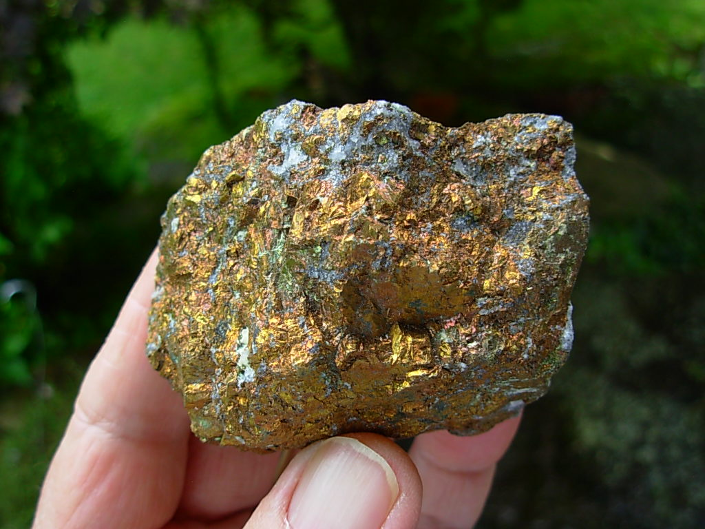

# MiNet
> A convolutional neural network for identifying and categorizing hand specimen images of minerals

## Table of Contents

* [General info](#general-info)
* [Data](#data)
* [Technologies](#technologies)
* [Future work](#future-work)

## General info

Identification of minerals in the field is a task that is wrought with many challenges. Traditional approaches require expertise and are prone to errors. Deep learning methods can help overcome some of these hurdles to provide simple and effective ways to identify minerals. However, existing techniques mainly make use of features of the minerals under a microscope and tend to favour a manual feature extraction pipeline. We present an algorithm for identifying minerals from hand specimen images. Using a Convolutional Neural Network (CNN), we develop a single-label image classification model to identify and categorise seven classes of minerals.

## Data

A dataset of 952 hand specimen images of minerals were scraped from the internet. The images are in the following classes:
* Biotite
* Bornite
* Chrysocolla
* Malachite
* Muscovite
* Pyrite
* Quartz

## Technologies

The project is created with:
* Python 3.6+
* Pytorch 1.0
* Fastai 

## Future work

There is much to be discovered in this area and we intend to look next at images of minerals under the microscope.

## License

This project is licensed under the terms of the MIT license. See the [LICENSE](LICENSE) file for license rights and limitations
